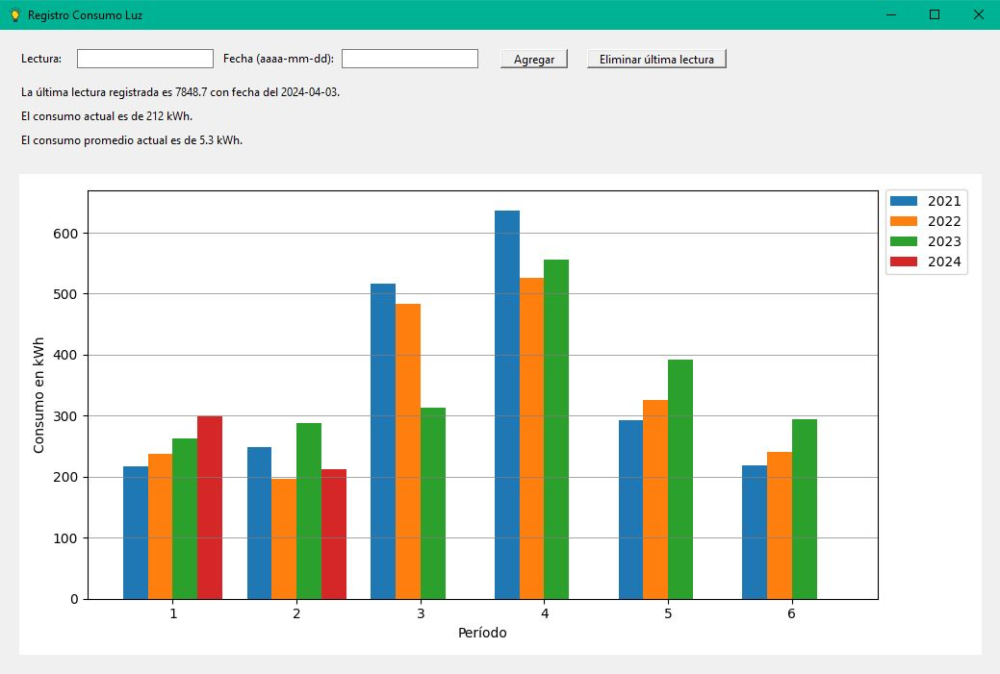

<!-- ## Introducción -->

Aplicación para controlar el consumo de luz.
Se divide el año en períodos bimestrales. El primer período inicia el día 26 de diciembre del año anterior y cierra el día 25 de febrero del año corriente.  
El programa realiza el cálculo del consumo por períodos, como así el consumo actual. Grafica los últimos 4 años de la base de datos.

**Notas:** 
* Se incluye en el repositorio una base de datos de ejemplo. Es necesario que la aplicación y la base de datos estén en la misma ubicación al momento de ejecutarse el programa.
* Si no se tiene una base de datos, el programa creará una al ejecutarse por primera vez. 
* Si la base de datos no cuenta con un mínimo de 4 años, el programa se encarga de completar con cero los datos faltantes. Este autocompletado no queda guardado en la base de datos, solo sirve con el fin de poder realizar el gráfico. 
* No es necesario realizar la carga de la lectura todos los días, pero sí se requiere realizarlo los día 25 del bimestre que cierra y del día 26 del bimestre que inicia.